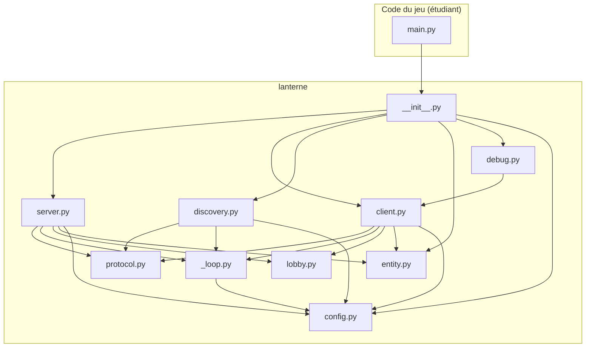
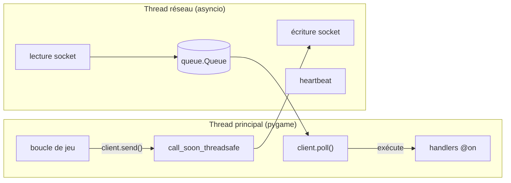
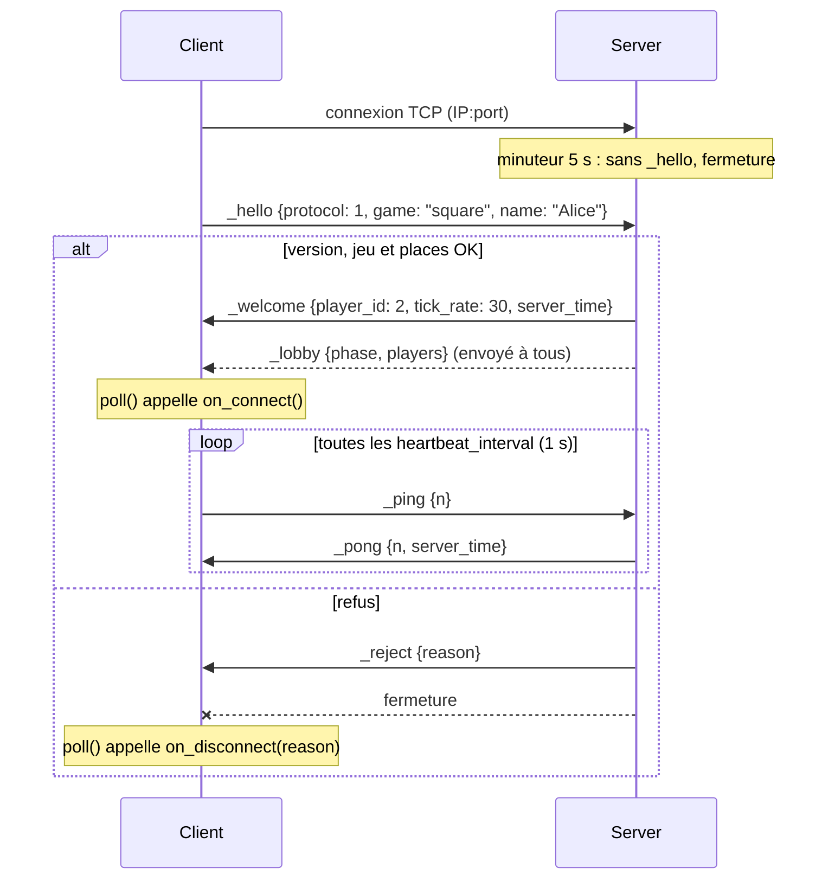
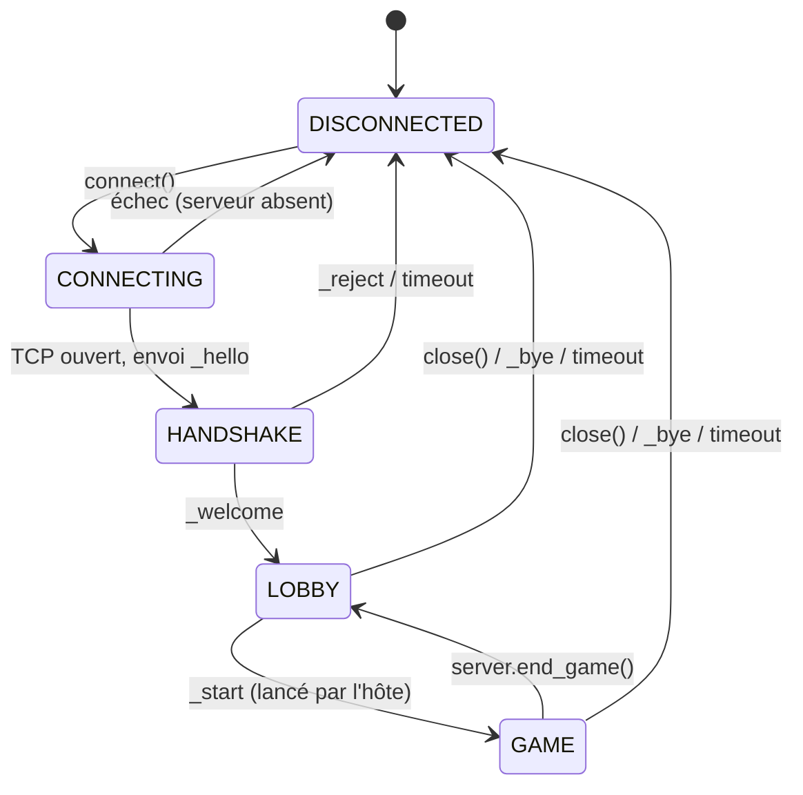
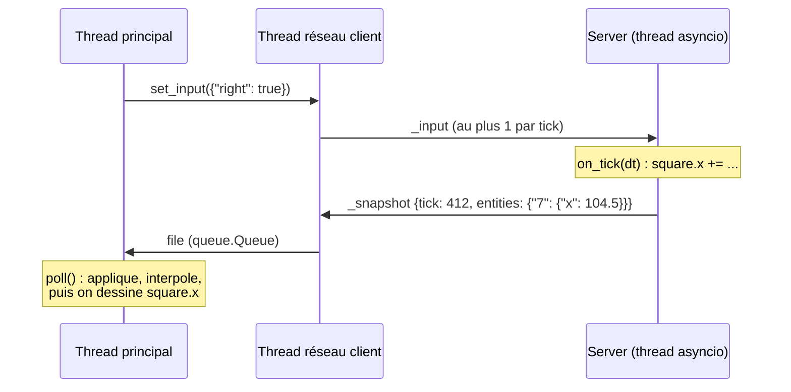

# Architecture de LANterne

> Statut : **proposition**. Ce document décrit comment la bibliothèque doit
> fonctionner, avant d'écrire le code. L'API publique détaillée est dans
> [API.md](API.md).

## 1. Vue d'ensemble

LANterne ajoute du multijoueur en **réseau local** (LAN, *Local Area Network* :
les machines d'une même salle ou d'un même Wi-Fi) à un jeu pygame-ce. Elle
utilise uniquement la bibliothèque standard de Python.

Le modèle est **client/serveur** : un programme central, le *serveur*, connaît
le vrai état de la partie. Chaque joueur lance un *client* qui s'y connecte,
envoie ses actions (touches appuyées) et reçoit l'état du jeu pour l'afficher.
Le serveur **fait autorité** : lui seul décide où sont les objets. Un client ne
peut donc pas tricher en annonçant une fausse position.

Il y a deux façons de lancer le serveur :

- **listen server** : un des joueurs, l'*hôte*, fait tourner le serveur dans
  le même programme que son jeu. Son propre client se connecte à
  `127.0.0.1` (l'adresse qui désigne « ma propre machine »), exactement comme
  les autres joueurs. Il n'y a donc qu'un seul chemin de code, que l'on soit
  hôte ou invité.
- **serveur dédié** : le même code serveur, lancé seul, sans fenêtre pygame.

Côté développeur de jeu, l'usage tient en trois idées :

1. `send(type, données)` envoie un message ; `@on(type)` déclare la fonction
   qui le reçoit.
2. `client.poll()`, appelé une fois par frame dans la boucle pygame, exécute
   les messages reçus. Il ne bloque jamais.
3. Les objets partagés héritent de `NetworkEntity` : le serveur modifie leurs
   attributs, les clients voient les changements automatiquement et de façon
   fluide.

## 2. Modules de `src/lanterne/`

| Module | Milestone | Rôle |
|---|---|---|
| `__init__.py` | M1 | Réexporte l'API publique (`Server`, `Client`, `Config`…) et `__version__`. |
| `config.py` | M1 | Classe `Config` : tous les réglages (ports, tick, délais, simulation…) au même endroit. |
| `protocol.py` | M1 | Format des messages : découpage par longueur, encodage/décodage JSON, types réservés, `PROTOCOL_VERSION`. Fonctions pures, sans réseau, donc faciles à tester. |
| `_loop.py` | M1 | Interne. `NetworkThread` : lance une boucle asyncio dans un thread secondaire, permet d'y envoyer du travail depuis le thread principal, et applique la simulation de latence/perte (M4) aux messages sortants. |
| `server.py` | M1 | `Server` (connexions, handshake, heartbeat, handlers, tick) et `Player` (un joueur connecté vu par le serveur). |
| `client.py` | M1 | `Client` : connexion, `send()`, `@on()`, `poll()`, état local (joueurs, entités). |
| `lobby.py` | M2 | `PlayerInfo` (id, pseudo, prêt, hôte) et `Phase` (`LOBBY` / `GAME`). |
| `discovery.py` | M2 | Découverte LAN par UDP : `ServerBrowser` côté client, répondeur côté serveur, `ServerInfo`. |
| `entity.py` | M3 | `NetworkEntity`, `replicated()`, registre des classes, construction des snapshots, interpolation. |
| `debug.py` | M4 | `DebugOverlay` (affichage pygame), `NetStats`, `enable_logging()`. |



`protocol.py`, `config.py`, `lobby.py` et `entity.py` n'importent jamais
pygame. Seul `debug.py` l'utilise (pour dessiner l'overlay), et seulement à
l'intérieur de ses fonctions : un serveur dédié peut tourner sans pygame.

## 3. Modèle de concurrence : asyncio dans un thread

### Vocabulaire

- **Thread** : un fil d'exécution. Un programme peut en avoir plusieurs qui
  avancent en parallèle et partagent la même mémoire.
- **asyncio** : module standard qui gère beaucoup d'opérations réseau dans un
  **seul** thread. Une *boucle d'événements* (event loop) passe d'une tâche à
  l'autre chaque fois qu'une tâche attend (`await`) des données.
- **Bloquant** : un appel est bloquant s'il met le programme en pause en
  attendant quelque chose (par exemple `socket.recv()` qui attend des octets).
  Dans une boucle pygame, un appel bloquant fige la fenêtre.

### Le choix

Chaque `Server`, `Client` et `ServerBrowser` possède un `NetworkThread` : un
thread secondaire qui fait tourner **sa** boucle asyncio. Tout le réseau
(sockets, heartbeat, tick du serveur) se passe dans ce thread. Le thread
principal, celui de pygame, ne touche jamais aux sockets, et le thread réseau
ne touche jamais à pygame.

Les deux threads communiquent par une **file** (`queue.Queue`), une structure
*thread-safe* (utilisable sans risque par plusieurs threads à la fois) :



- **Réception** : le thread réseau lit un message complet, le décode, puis le
  pose dans la file. `client.poll()` vide la file et appelle les handlers
  `@on` **dans le thread principal**. Les handlers peuvent donc utiliser
  pygame sans risque.
- **Envoi** : `client.send()` encode le message puis le confie à la boucle
  asyncio avec `loop.call_soon_threadsafe()`. `send()` rend la main
  immédiatement : il ne bloque jamais le jeu.

Pour le **serveur**, c'est plus simple : ses handlers (`@server.on`,
`on_tick`…) s'exécutent directement dans son thread asyncio, les uns après les
autres. Comme il n'y a qu'un seul thread, deux handlers ne tournent jamais en
même temps : pas besoin de verrous. En contrepartie, un handler serveur doit
être rapide et ne jamais appeler `time.sleep()`, car il bloquerait tout le
serveur. Il ne doit pas non plus utiliser pygame.

Chez l'hôte (listen server), on a donc trois threads : le thread principal
(pygame + client), le thread du serveur, et le thread du client.
En serveur dédié, `server.run()` fait tourner la boucle asyncio directement
dans le thread principal.

**L'utilisateur n'écrit jamais `async` ni `await`** : asyncio reste caché dans
la bibliothèque. Les handlers sont des fonctions normales.

### Pourquoi asyncio plutôt que threading + selectors

- Le serveur gère plusieurs connexions **et** des minuteries (heartbeat chaque
  seconde, tick 30 fois par seconde). asyncio fournit les deux
  (`asyncio.start_server`, `asyncio.sleep`) dans un seul thread.
- `StreamReader.readexactly(n)` lit exactement *n* octets : le découpage des
  messages (section 4) devient trivial.
- Un seul thread côté serveur supprime les problèmes d'accès concurrents
  (*race conditions*) qu'aurait un thread par joueur.
- Le réseau vit dans son propre thread : si le jeu ralentit (chargement,
  FPS bas), le heartbeat et le tick continuent normalement.

## 4. Format des messages

### Transport : TCP

**TCP** est un protocole qui garantit que les octets arrivent **tous** et
**dans l'ordre**. En échange, TCP est un *flux* d'octets : il ne connaît pas la
notion de « message ». Si on envoie deux messages, le destinataire peut les
recevoir collés, ou coupés en morceaux. Il faut donc un **framing** (découpage)
: une règle qui dit où chaque message commence et finit.

On désactive l'**algorithme de Nagle** (`TCP_NODELAY`) : sinon TCP regroupe
les petits paquets et ajoute jusqu'à ~40 ms de retard.

### Trame (frame)

Chaque message est envoyé sous la forme :

```
+-----------------------------+-------------------------------+
| longueur : 4 octets         | corps : <longueur> octets     |
| entier non signé big-endian | JSON encodé en UTF-8          |
| struct.pack("!I", n)        |                               |
+-----------------------------+-------------------------------+
```

- *Big-endian* : l'octet de poids fort est envoyé en premier (ordre standard
  sur le réseau, c'est le `!` de `struct`).
- Le récepteur lit 4 octets, en déduit `n`, puis lit exactement `n` octets.
- Si `n` dépasse `Config.max_message_size` (1 Mio par défaut), la connexion
  est fermée **avant** de lire le corps. Cela évite qu'un client malveillant
  fasse allouer des gigaoctets au serveur.

**Sérialiser**, c'est transformer un objet Python en octets. On utilise JSON
(`json.dumps(..., separators=(",", ":"), allow_nan=False)`) : lisible,
standard, et sûr. Exemple réel :

```
00 00 00 19 {"t":"_ping","d":{"n":3}}
└─ 25 ───┘ └──────── 25 octets ────────┘
```

### Enveloppe

Le corps JSON est toujours un objet à deux clés :

```json
{"t": "move", "d": {"dx": 1, "dy": 0}}
```

- `t` (*type*) : chaîne qui identifie le message ; c'est la clé de `@on(...)`.
- `d` (*data*) : n'importe quelle valeur JSON (objet, liste, nombre, chaîne,
  `null`).

Les types qui commencent par `_` sont **réservés** à la bibliothèque.
`send("_truc", ...)` lève une `ValueError`. Tous les autres types sont libres
pour le jeu.

Rappel JSON : un tuple devient une liste, et les clés d'objet sont toujours des
chaînes (`{1: "a"}` devient `{"1": "a"}`).

### Types réservés

| Type | Sens | Données (`d`) | Milestone |
|---|---|---|---|
| `_hello` | C → S | `{"protocol": 1, "game": "square", "name": "Alice"}` | M1 |
| `_welcome` | S → C | `{"player_id": 2, "tick_rate": 30, "server_time": 12.5}` | M1 |
| `_reject` | S → C | `{"reason": "version_mismatch"}` puis fermeture | M1 |
| `_ping` | C → S | `{"n": 3}` | M1 |
| `_pong` | S → C | `{"n": 3, "server_time": 13.52}` | M1 |
| `_bye` | C ↔ S | `{"reason": "quit"}` puis fermeture | M1 |
| `_lobby` | S → C | `{"phase": "lobby", "players": [{"id": 1, "name": "Alice", "ready": true, "is_host": true}]}` | M2 |
| `_ready` | C → S | `{"ready": true}` | M2 |
| `_start` | C → S (hôte) puis S → C | `{}` | M2 |
| `_chat` | C → S | `{"text": "gg"}` | M2 |
| `_chat` | S → C | `{"from": 2, "text": "gg"}` | M2 |
| `_input` | C → S | `{"left": true, "right": false}` | M3 |
| `_spawn` | S → C | `{"id": 7, "cls": "Square", "owner": 2, "state": {"x": 100.0, "y": 50.0}}` | M3 |
| `_despawn` | S → C | `{"id": 7}` | M3 |
| `_snapshot` | S → C | `{"tick": 412, "entities": {"7": {"x": 104.5}}}` | M3 |

Valeurs possibles de `reason` pour `_reject` : `version_mismatch`,
`wrong_game`, `server_full`, `game_in_progress`, `bad_handshake`.

### Handshake

Le **handshake** (poignée de main) est l'échange qui ouvre une connexion : le
client se présente, le serveur vérifie qu'ils parlent le même protocole, puis
l'accepte ou le refuse. Le numéro `PROTOCOL_VERSION` (dans `protocol.py`)
augmente à chaque changement incompatible du format ; deux versions
différentes ne peuvent pas jouer ensemble.



Le serveur vérifie, dans cet ordre : `_hello` reçu en premier et bien formé,
`protocol == PROTOCOL_VERSION`, `game == Config.game_id` (on n'accepte pas un
client d'un autre jeu), nombre de joueurs `< max_players`, phase `LOBBY` (ou
`allow_join_in_game`). Si deux joueurs ont le même pseudo, le serveur ajoute
un suffixe (`Alice (2)`).

### Heartbeat et déconnexions

Le **heartbeat** (battement de cœur) est un petit message envoyé
régulièrement pour prouver qu'on est toujours là. Le client envoie `_ping`
toutes les `heartbeat_interval` secondes (1 s) et le serveur répond `_pong`.

- Le client en tire le **RTT** (*Round-Trip Time*, temps d'aller-retour
  d'un message, souvent appelé « ping ») et l'heure du serveur (section 6).
- Chaque côté considère l'autre comme perdu s'il n'a **rien** reçu (n'importe
  quel message) pendant `timeout` secondes (5 s). Cela détecte un câble
  débranché ou un jeu planté, que TCP seul met parfois des minutes à signaler.

Une déconnexion peut être :

| Cas | Détection | `reason` |
|---|---|---|
| Départ propre | `_bye` reçu | `"quit"` |
| Exclusion | `server.kick()` envoie `_bye` | `"kicked"` |
| Fermeture brutale | fin de flux TCP (EOF) ou erreur socket | `"connection_lost"` |
| Silence | aucun message pendant `timeout` | `"timeout"` |
| Message invalide | JSON cassé, trop gros, type inconnu réservé | `"protocol_error"` |

Côté serveur : `on_disconnect(player, reason)` est appelé, le joueur est retiré
de la liste, ses entités sont supprimées (`despawn_on_disconnect`), un `_lobby`
à jour est envoyé aux autres. Si l'hôte part, le serveur d'un listen server
s'arrête avec son programme ; les clients reçoivent `connection_lost`.

## 5. Cycle de vie d'une partie



1. **Découverte (optionnelle).** Le client lance un `ServerBrowser` qui
   diffuse en **broadcast UDP** une question. *UDP* est un autre protocole
   réseau : il envoie des paquets isolés (*datagrammes*), sans garantie
   d'arrivée, et permet le *broadcast*, c'est-à-dire l'envoi à toutes les
   machines du réseau local (adresse `255.255.255.255`). Les serveurs qui
   écoutent sur `discovery_port` répondent directement au client :

   ```json
   {"t": "_discover", "d": {"protocol": 1, "game": "square"}}
   {"t": "_announce", "d": {"name": "Partie d'Alice", "port": 5050, "players": 1, "max_players": 4, "phase": "lobby"}}
   ```

   Un datagramme UDP est déjà un message complet : pas de préfixe de
   longueur ici. L'IP du serveur est celle d'où vient la réponse. Le client
   repose la question chaque seconde tant que le navigateur est ouvert.
   On a choisi « le client demande, les serveurs répondent » plutôt que « les
   serveurs s'annoncent » : ainsi plusieurs clients peuvent tourner sur le
   même PC (utile pour tester), car seul le serveur réserve le port de
   découverte. Si le réseau bloque le broadcast (certains Wi-Fi d'école), on
   peut toujours saisir l'IP à la main.

2. **Connexion et handshake** (section 4).

3. **Lobby** (salon d'attente). Chaque joueur a un **id** (entier attribué
   par le serveur, jamais réutilisé pendant la vie du serveur) et un
   **pseudo**. Le premier joueur connecté est l'**hôte** (`is_host`). Les
   joueurs se déclarent prêts (`_ready`), discutent (`_chat`, 200 caractères
   max). Chaque changement renvoie la liste complète à tous (`_lobby`).
   L'hôte envoie `_start` ; le serveur ne l'accepte que si tous les joueurs
   sont prêts, passe en phase `GAME`, appelle `on_game_start()` et relaie
   `_start` à tous. Avec `Config(use_lobby=False)`, le lobby est sauté : le
   serveur est en `GAME` dès le démarrage (pratique pour les petits jeux).

4. **Jeu.** Voir section 6.

5. **Fin.** `server.end_game()` supprime les entités et revient au lobby.
   `client.close()` envoie `_bye` et arrête le thread réseau.

## 6. Synchronisation (M3)

### Tick fixe

Le **tick** est un pas de simulation du serveur. Le serveur en exécute
`tick_rate` par seconde (30 par défaut), quel que soit le nombre de FPS des
clients. À chaque tick :

1. il appelle `on_tick(dt)` avec `dt = 1 / tick_rate` (pas de temps fixe :
   le jeu se comporte pareil sur tous les PC) ;
2. il construit un **snapshot** (photo de l'état) contenant les attributs
   répliqués qui ont changé depuis le tick précédent ;
3. il l'envoie à tous les clients, même vide (le numéro de tick sert
   d'horloge).

Si le serveur a pris du retard, il enchaîne les ticks manquants (au plus 5)
pour rattraper.

Les messages reçus sont traités à leur arrivée, entre deux ticks.

### Entrées

Un client pourrait envoyer un message à chaque frame, mais à 144 FPS cela
ferait 144 messages par seconde. `client.set_input(dict)` mémorise l'état des
touches ; le thread réseau n'envoie `_input` qu'une fois par tick et
seulement si l'état a changé. Le serveur range la dernière valeur dans
`player.input`, que `on_tick` lit. Le serveur doit traiter ces données comme
non fiables (valider, borner les valeurs).

### NetworkEntity et attributs répliqués

```python
class Square(NetworkEntity):
    x = replicated(0.0, interpolate=True)
    color = replicated([255, 0, 0])
```

`replicated()` crée un *descripteur* Python : un objet qui intercepte
`entity.x = ...`. Côté serveur, chaque affectation marque l'attribut comme
modifié (*dirty*) ; seuls les attributs modifiés partent dans le snapshot
suivant (**delta**). C'est sûr parce que TCP garantit l'ordre et l'arrivée :
aucun delta n'est perdu. Un joueur qui arrive reçoit un `_spawn` avec l'état
complet de chaque entité.

Chaque sous-classe de `NetworkEntity` est enregistrée sous son nom
(`"Square"`) : le `_spawn` indique le nom, et le client instancie la même
classe. Le client et le serveur doivent donc importer les mêmes classes.
Les valeurs doivent être sérialisables en JSON.

### Interpolation

Les snapshots arrivent 30 fois par seconde alors que l'écran se rafraîchit 60
fois ou plus. Afficher directement la dernière position donnerait un
mouvement saccadé. L'**interpolation** consiste à afficher une position
calculée *entre* deux snapshots connus.

Le client affiche le monde avec un petit retard volontaire,
`interpolation_delay` (80 ms ≈ 2,5 ticks) :

1. L'heure du serveur est estimée grâce au `_pong` :
   `heure_serveur ≈ server_time + RTT / 2` (méthode de Cristian).
2. `temps_rendu = heure_serveur_estimée − interpolation_delay`.
3. Pour chaque attribut `interpolate=True`, on prend les deux snapshots A et B
   qui encadrent `temps_rendu` et on calcule
   `valeur = A + (B − A) × (temps_rendu − tA) / (tB − tA)`.
4. S'il n'y a pas encore de B (réseau en retard), on garde la dernière valeur
   connue (pas d'extrapolation).

Ce calcul est fait dans `client.poll()`. Lire `square.x` côté client donne
directement la valeur interpolée.



**Limite connue :** le propre carré du joueur est affiché avec environ
RTT + 1 tick + `interpolation_delay` de retard (~120 ms en LAN). C'est
acceptable pour des jeux étudiants ; la *prédiction côté client* est écartée
(section 8).

## 7. Outils (M4)

- **Logs** : module standard `logging`, logger `"lanterne"` (sous-loggers
  `lanterne.server`, `lanterne.client`…). `enable_logging("DEBUG")` affiche
  chaque message envoyé et reçu.
- **Statistiques** : `client.stats` (`NetStats`) : RTT, octets et messages par
  seconde dans chaque sens, fréquence des snapshots, nombre d'entités.
- **Overlay de debug** : `DebugOverlay(client).draw(screen)` dessine ces
  statistiques en haut de l'écran ; F3 l'affiche ou le cache.
- **Simulation de mauvais réseau** : un LAN est presque parfait, ce qui cache
  les bugs. `Config.sim_latency`, `sim_jitter` et `sim_loss` ajoutent un
  retard aux messages **sortants**, dans le thread réseau (jamais dans le
  jeu). La *gigue* (*jitter*) est la variation aléatoire de ce retard.
  Attention : sur TCP, un paquet perdu n'est pas perdu pour l'application,
  TCP le renvoie. `sim_loss` simule donc l'**effet** d'une perte : la
  probabilité qu'un message soit retardé d'une retransmission (+200 ms), et
  tous ceux qui le suivent avec lui, car TCP livre dans l'ordre. L'ordre des
  messages est toujours conservé.

## 8. Choix écartés

| Option | Pourquoi on ne la retient pas |
|---|---|
| `pickle` pour sérialiser | Désérialiser du pickle reçu du réseau permet d'exécuter du code arbitraire sur la machine : n'importe quel joueur pourrait prendre le contrôle des autres PC. JSON ne contient que des données. |
| UDP pour les messages de jeu | Il faudrait réécrire nous-mêmes accusés de réception, renvoi et ordre. En LAN, les pertes sont rares et le retard de TCP est négligeable (avec `TCP_NODELAY`). UDP n'est utilisé que pour la découverte, où le broadcast est indispensable. |
| Sockets non bloquants lus dans la boucle pygame, sans thread | Le réseau dépendrait des FPS : si le jeu fige (chargement), heartbeat et tick serveur figent aussi et les joueurs sont déconnectés. |
| threading + selectors | Viable, mais les minuteries (heartbeat, tick) et la lecture de messages complets seraient à écrire à la main. asyncio les fournit. |
| Un thread par joueur côté serveur | Plusieurs threads modifieraient le même état de jeu en même temps : il faudrait des verrous partout, source de bugs difficiles. |
| Exposer `async`/`await` à l'utilisateur | Trop difficile pour des débutants en pygame ; asyncio reste interne. |
| Pair-à-pair (chaque joueur connecté à tous) | Pas d'arbitre unique en cas de désaccord, N×(N−1)/2 connexions, triche facile. |
| Clients qui envoient leur position | Contraire au serveur qui fait autorité : un client pourrait se téléporter. |
| Hôte qui lit l'état du serveur sans client local | Deux chemins de code (hôte/invité) à maintenir et tester ; passer par `127.0.0.1` coûte moins d'une milliseconde. |
| Snapshots complets à chaque tick | Plus simple mais gaspille la bande passante ; les deltas sont sûrs sur TCP. |
| Prédiction côté client, compensation de latence | Complexes (réconciliation, rembobinage) et peu utiles en LAN. Piste d'amélioration après M4. |
| msgpack, protobuf | Hors bibliothèque standard. |
| Découpage par saut de ligne (`\n`) | Imposé par l'énoncé : préfixe de longueur. Il permet aussi de refuser un message trop gros avant de le lire, et d'utiliser `readexactly`. |

## 9. Tests prévus

- `protocol.py` : encodage/décodage aller-retour, message coupé en morceaux,
  plusieurs messages collés, taille maximale, JSON invalide, type réservé.
- Serveur et client sur `127.0.0.1` avec un port libre : handshake accepté et
  refusé, heartbeat/timeout (avec des délais courts dans `Config`), lobby,
  réplication d'une entité.
- Interpolation : fonctions pures testées avec des snapshots fabriqués.
